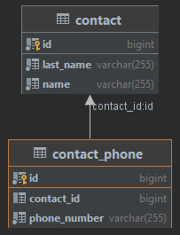

# Contacts Operations Backend Application

This backend application is used to import or retrieve the data by name, it has two endpoints which have a POST and a
GET method.

## Work Process

POST method can be used through localhost:8090/contacts with sending sampleImportForPost.json or likewise requests. GET
method can be used only with sending the name variable.

```bash
curl http://localhost:8070/contacts?name=Ahmet
curl -X http://localhost:8070/contacts
```

## Usage

Use the [docker-compose](./docker/docker-compose.yml) file to set MySQL database.

```bash
docker-compose up
```

Build the application to generate jar file.

```maven
mvn clean install
```

Under target directory run;

```bash
java -jar contacts-operations-0.0.1-SNAPSHOT.jar
```

## Database Structure
